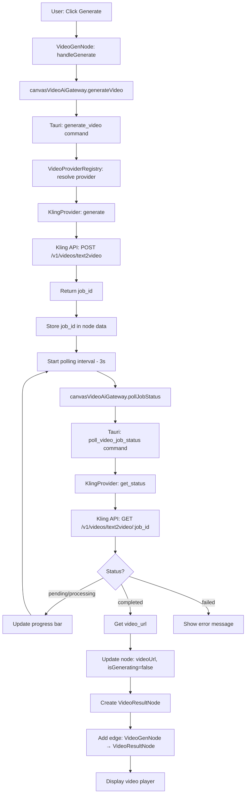
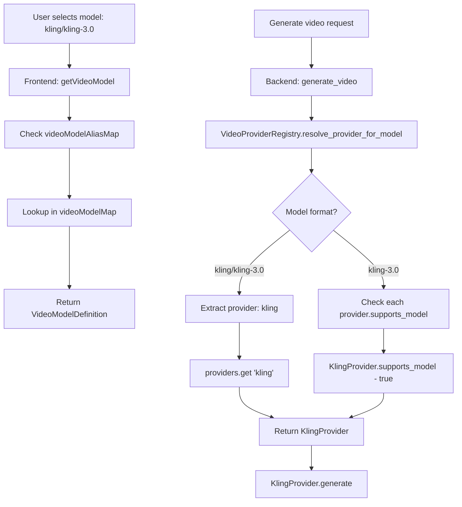

# Video Generation Implementation Guide

**Version:** 1.0
**Last Updated:** 2026-03-12
**Purpose:** Reference documentation for extending video generation APIs and providers

---

## Table of Contents

1. [Architecture Overview](#architecture-overview)
2. [Backend Implementation (Rust/Tauri)](#backend-implementation-rusttauri)
3. [Frontend Implementation (TypeScript/React)](#frontend-implementation-typescriptreact)
4. [Data Flow](#data-flow)
5. [Adding a New Video Provider](#adding-a-new-video-provider)
6. [Key Patterns and Conventions](#key-patterns-and-conventions)
7. [Testing](#testing)
8. [Troubleshooting](#troubleshooting)

---

## Architecture Overview

The video generation system follows a **provider-agnostic architecture** similar to the existing image generation system. It consists of:

### Key Components

**Backend (Rust/Tauri):**
- `VideoProvider` trait - defines the interface all providers must implement
- `VideoProviderRegistry` - manages provider registration and model routing
- Provider implementations (e.g., `KlingProvider`) - handles API-specific logic
- `VideoCacheManager` - LRU cache for generated videos
- Tauri commands - expose Rust functions to frontend

**Frontend (TypeScript/React):**
- Model registry - auto-discovers video models via glob imports
- `VideoGenNode` - interactive node for video generation
- `VideoResultNode` - downstream node for preview and download
- Video gateway - abstracts Tauri command invocations
- Settings integration - API key management and download paths

### Design Principles

1. **Separation of concerns** - Business logic in backend, UI in frontend
2. **Provider abstraction** - Easy to add new providers without changing core logic
3. **Type safety** - Full TypeScript and Rust type definitions
4. **Async job pattern** - Submit job → Poll status → Display result
5. **Auto-discovery** - Models registered via file conventions, not manual registration
6. **Parallel to image system** - Consistent patterns with existing image generation

---

## Backend Implementation (Rust/Tauri)

### Directory Structure

```
src-tauri/src/ai/video/
├── mod.rs                      # VideoProvider trait + registry
├── types.rs                    # Core types (request, response, job status)
├── error.rs                    # VideoError enum
├── cache_manager.rs            # LRU cache for videos
└── providers/
    ├── mod.rs                  # build_default_video_providers()
    └── kling/
        └── mod.rs              # KlingProvider implementation
```

### Core Types (`types.rs`)

```rust
pub struct VideoGenerateRequest {
    pub prompt: String,
    pub model: String,
    pub duration: Option<u32>,
    pub aspect_ratio: Option<String>,
    pub enable_audio: Option<bool>,
    pub seed: Option<i64>,
    pub start_frame_url: Option<String>,
    pub end_frame_url: Option<String>,
    pub extra_params: Option<HashMap<String, serde_json::Value>>,
}

pub struct VideoJobStatus {
    pub job_id: String,
    pub state: VideoJobState,
    pub progress: Option<f32>,
    pub video_url: Option<String>,
    pub error_message: Option<String>,
    pub created_at: Option<i64>,
    pub updated_at: Option<i64>,
}

pub enum VideoJobState {
    Pending,
    Processing,
    Completed,
    Failed,
    Timeout,
}
```

### VideoProvider Trait (`mod.rs`)

```rust
#[async_trait::async_trait]
pub trait VideoProvider: Send + Sync {
    /// Returns the provider name (e.g., "kling")
    fn name(&self) -> &str;

    /// Checks if the provider supports a given model
    fn supports_model(&self, model: &str) -> bool;

    /// Lists all models supported by this provider
    fn list_models(&self) -> Vec<String>;

    /// Sets the API key for this provider
    async fn set_api_key(&self, api_key: String) -> Result<(), VideoError>;

    /// Submits a video generation job and returns the job ID
    async fn generate(&self, request: VideoGenerateRequest) -> Result<String, VideoError>;

    /// Gets the current status of a video generation job
    async fn get_status(&self, job_id: &str) -> Result<VideoJobStatus, VideoError>;
}
```

### Provider Implementation Pattern

Each provider follows this pattern:

```rust
pub struct KlingProvider {
    client: Client,
    api_key: Arc<RwLock<Option<String>>>,
    base_url: String,
}

impl KlingProvider {
    pub fn new() -> Self { /* ... */ }

    async fn submit_job(&self, request: VideoGenerateRequest) -> Result<String, VideoError> {
        // 1. Get API key
        // 2. Build request body (map fields to provider format)
        // 3. POST to provider's create endpoint
        // 4. Parse response and return job_id
    }

    async fn poll_job_status(&self, job_id: &str) -> Result<VideoJobStatus, VideoError> {
        // 1. GET provider's status endpoint
        // 2. Map provider status to VideoJobState
        // 3. Extract video_url if completed
        // 4. Return VideoJobStatus
    }
}

#[async_trait::async_trait]
impl VideoProvider for KlingProvider {
    fn name(&self) -> &str { "kling" }
    fn supports_model(&self, model: &str) -> bool { /* ... */ }
    async fn generate(&self, req: VideoGenerateRequest) -> Result<String, VideoError> {
        self.submit_job(req).await
    }
    async fn get_status(&self, job_id: &str) -> Result<VideoJobStatus, VideoError> {
        self.poll_job_status(job_id).await
    }
}
```

### Tauri Commands (`src-tauri/src/commands/video.rs`)

Commands exposed to frontend:

```rust
#[tauri::command]
pub async fn set_video_api_key(provider: String, api_key: String) -> Result<(), String>

#[tauri::command]
pub async fn generate_video(request: VideoGenerateRequestDto) -> Result<String, String>

#[tauri::command]
pub async fn poll_video_job_status(job_id: String, model: String) -> Result<VideoJobStatus, String>

#[tauri::command]
pub async fn list_video_models() -> Result<Vec<String>, String>

#[tauri::command]
pub async fn cache_video(app: AppHandle, video_url: String, video_id: String) -> Result<String, String>

#[tauri::command]
pub async fn get_video_cache_stats(app: AppHandle) -> Result<VideoCacheStats, String>

#[tauri::command]
pub async fn clear_video_cache(app: AppHandle) -> Result<usize, String>
```

### Registry Pattern

```rust
static REGISTRY: std::sync::OnceLock<VideoProviderRegistry> = std::sync::OnceLock::new();

fn get_registry() -> &'static VideoProviderRegistry {
    REGISTRY.get_or_init(|| {
        let mut registry = VideoProviderRegistry::new();
        for provider in build_default_video_providers() {
            registry.register_provider(provider);
        }
        registry
    })
}
```

---

## Frontend Implementation (TypeScript/React)

### Directory Structure

```
src/
├── features/canvas/
│   ├── models/
│   │   ├── types.ts                    # VideoModelDefinition interface
│   │   ├── videoRegistry.ts            # Auto-discovery + model lookup
│   │   ├── providers/
│   │   │   └── kling.ts                # Provider metadata
│   │   └── video/
│   │       └── kling/
│   │           └── kling30.ts          # Kling 3.0 model definition
│   ├── nodes/
│   │   ├── VideoGenNode.tsx            # Video generation node
│   │   └── VideoResultNode.tsx         # Video result/preview node
│   ├── domain/
│   │   ├── canvasNodes.ts              # VideoGenNodeData + VideoResultNodeData types
│   │   └── nodeRegistry.ts             # Node registration
│   ├── application/
│   │   ├── ports.ts                    # VideoAiGateway interface
│   │   └── canvasServices.ts           # Gateway instance export
│   └── infrastructure/
│       └── tauriVideoGateway.ts        # VideoAiGateway implementation
├── commands/
│   └── video.ts                        # Tauri command wrappers
└── stores/
    └── settingsStore.ts                # Video settings persistence
```

### Model Definition Pattern (`video/kling/kling30.ts`)

```typescript
import type { VideoModelDefinition } from '../../types';

export const KLING_30_MODEL_ID = 'kling/kling-3.0';

export const videoModel: VideoModelDefinition = {
  id: KLING_30_MODEL_ID,
  mediaType: 'video',
  displayName: 'Kling 3.0',
  providerId: 'kling',
  description: 'Kling 3.0 professional video generation model',
  eta: '~30s',
  expectedDurationMs: 30000,
  defaultDuration: 5,
  defaultAspectRatio: '16:9',
  durations: [
    { value: 3, label: '3s' },
    { value: 5, label: '5s' },
    { value: 10, label: '10s' },
    { value: 15, label: '15s' },
  ],
  aspectRatios: [
    { value: '16:9', label: '16:9' },
    { value: '9:16', label: '9:16' },
    { value: '1:1', label: '1:1' },
  ],
  supportsAudio: true,
  supportsSeed: true,
  supportsImageToVideo: true,
  extraParamsSchema: [
    {
      key: 'multi_shots',
      label: 'Multi Shots',
      type: 'boolean',
      description: 'Enable multiple camera angles',
      defaultValue: false,
    },
    {
      key: 'kling_elements',
      label: 'Kling Elements',
      type: 'array',
      description: 'Define elements for prompt references',
    },
  ],
  defaultExtraParams: {
    multi_shots: false,
    kling_elements: [],
  },
};
```

### Auto-Discovery Registry (`videoRegistry.ts`)

```typescript
const videoModelModules = import.meta.glob<{ videoModel: VideoModelDefinition }>(
  './video/**/*.ts',
  { eager: true }
);

const videoModels: VideoModelDefinition[] = Object.values(videoModelModules)
  .map((module) => module.videoModel)
  .filter((model): model is VideoModelDefinition => Boolean(model))
  .sort((a, b) => a.id.localeCompare(b.id));

export function listVideoModels(): VideoModelDefinition[] {
  return videoModels;
}

export function getVideoModel(modelId: string): VideoModelDefinition {
  const resolvedModelId = videoModelAliasMap.get(modelId) ?? modelId;
  return videoModelMap.get(resolvedModelId) ?? videoModelMap.get(DEFAULT_VIDEO_MODEL_ID)!;
}
```

### Node Data Types (`domain/canvasNodes.ts`)

```typescript
export interface VideoGenNodeData extends NodeDisplayData {
  prompt: string;
  model: string;
  duration: number;
  aspectRatio: string;
  enableAudio: boolean;
  seed: number | null;
  startFrameUrl: string | null;
  endFrameUrl: string | null;
  extraParams: Record<string, unknown>;
  videoUrl: string | null;
  thumbnailUrl: string | null;
  isGenerating: boolean;
  generationStartedAt: number | null;
  generationDurationMs: number;
  jobId: string | null;
  errorMessage: string | null;
}

export interface VideoResultNodeData extends NodeDisplayData {
  videoUrl: string;
  thumbnailUrl?: string | null;
  prompt?: string;
  duration?: number;
  aspectRatio?: string;
}
```

### Node Registration (`domain/nodeRegistry.ts`)

```typescript
const videoGenNodeDefinition: CanvasNodeDefinition<VideoGenNodeData> = {
  type: CANVAS_NODE_TYPES.videoGen,
  menuLabelKey: 'node.menu.videoGeneration',
  menuIcon: 'sparkles',
  visibleInMenu: true,
  capabilities: {
    toolbar: true,
    promptInput: false,
  },
  connectivity: {
    sourceHandle: true,
    targetHandle: true,
    connectMenu: {
      fromSource: true,
      fromTarget: false,
    },
  },
  createDefaultData: () => ({
    displayName: DEFAULT_NODE_DISPLAY_NAME[CANVAS_NODE_TYPES.videoGen],
    prompt: '',
    model: DEFAULT_VIDEO_MODEL_ID,
    duration: 5,
    aspectRatio: '16:9',
    enableAudio: true,
    seed: null,
    startFrameUrl: null,
    endFrameUrl: null,
    extraParams: {},
    videoUrl: null,
    thumbnailUrl: null,
    isGenerating: false,
    generationStartedAt: null,
    generationDurationMs: 0,
    jobId: null,
    errorMessage: null,
  }),
};
```

### VideoGenNode Component Pattern

Key responsibilities:
1. **Prompt input** - with reference token support (@图1, @图2)
2. **Frame selection** - visual UI for start/end frames from connected images
3. **Parameter controls** - model, duration, aspect ratio, audio, seed
4. **Extra params** - multi_shots, kling_elements
5. **Generation** - submit job via gateway, store job_id
6. **Polling** - 3-second interval, update progress, handle completion
7. **Result node creation** - automatically create VideoResultNode on success

```typescript
// Polling effect (simplified)
useEffect(() => {
  if (!data.isGenerating || !data.jobId) return;

  const pollStatus = async () => {
    const status = await canvasVideoAiGateway.pollJobStatus(data.jobId!, data.model);

    if (status.state === 'completed' && status.videoUrl) {
      updateNodeData(id, {
        videoUrl: status.videoUrl,
        isGenerating: false,
        jobId: null,
      });

      // Create VideoResultNode downstream
      const resultPosition = findNodePosition(id, VIDEO_RESULT_NODE_WIDTH, VIDEO_RESULT_NODE_HEIGHT);
      const resultNodeId = addNode(CANVAS_NODE_TYPES.videoResult, resultPosition, {
        videoUrl: status.videoUrl,
        prompt: data.prompt,
        duration: data.duration,
        aspectRatio: data.aspectRatio,
      });
      addEdge(id, resultNodeId);
    }
  };

  pollStatus();
  const intervalId = setInterval(pollStatus, 3000);
  return () => clearInterval(intervalId);
}, [data.isGenerating, data.jobId, /* ... */]);
```

### VideoResultNode Component

Responsibilities:
1. **Video preview** - HTML5 `<video>` element with controls
2. **Download** - browser download (fetch + blob) or Tauri file save
3. **Preset paths** - show up to 3 quick-download buttons from settings

```typescript
const handleDownload = async (targetPath?: string) => {
  if (targetPath) {
    // Tauri file save
    await downloadVideoToDirectory(url, `${targetPath}/${filename}`, true);
  } else {
    // Browser download
    const response = await fetch(url);
    const blob = await response.blob();
    const blobUrl = URL.createObjectURL(blob);
    const link = document.createElement('a');
    link.href = blobUrl;
    link.download = filename;
    link.click();
    setTimeout(() => URL.revokeObjectURL(blobUrl), 1000);
  }
};
```

---

## Data Flow

### Video Generation Flow



### Model Resolution Flow



---

## Adding a New Video Provider

Follow these steps to add a new video provider (e.g., "runway"):

### Step 1: Backend - Create Provider Implementation

**File:** `src-tauri/src/ai/video/providers/runway/mod.rs`

```rust
use reqwest::Client;
use std::sync::Arc;
use tokio::sync::RwLock;

use crate::ai::video::error::VideoError;
use crate::ai::video::types::{VideoGenerateRequest, VideoJobState, VideoJobStatus};
use crate::ai::video::VideoProvider;

const RUNWAY_BASE_URL: &str = "https://api.runwayml.com";
const SUPPORTED_MODELS: [&str; 2] = ["gen-3", "runway/gen-3"];

// Define request/response DTOs
#[derive(Debug, Serialize)]
struct RunwayCreateRequest {
    prompt: String,
    duration: Option<u32>,
    // ... other fields
}

#[derive(Debug, Deserialize)]
struct RunwayCreateResponse {
    id: String,
    status: String,
}

pub struct RunwayProvider {
    client: Client,
    api_key: Arc<RwLock<Option<String>>>,
}

impl RunwayProvider {
    pub fn new() -> Self {
        Self {
            client: Client::new(),
            api_key: Arc::new(RwLock::new(None)),
        }
    }

    async fn submit_job(&self, request: VideoGenerateRequest) -> Result<String, VideoError> {
        // 1. Get API key
        let api_key = self.api_key.read().await.clone()
            .ok_or_else(|| VideoError::InvalidRequest("API key not set".into()))?;

        // 2. Build request body
        let body = RunwayCreateRequest {
            prompt: request.prompt,
            duration: request.duration,
        };

        // 3. POST to Runway API
        let response = self.client
            .post(&format!("{}/v1/generations", RUNWAY_BASE_URL))
            .header("Authorization", format!("Bearer {}", api_key))
            .json(&body)
            .send()
            .await?;

        // 4. Parse and return job_id
        let result: RunwayCreateResponse = response.json().await?;
        Ok(result.id)
    }

    async fn poll_job_status(&self, job_id: &str) -> Result<VideoJobStatus, VideoError> {
        // Similar pattern: GET status endpoint, map to VideoJobStatus
        // ...
    }
}

#[async_trait::async_trait]
impl VideoProvider for RunwayProvider {
    fn name(&self) -> &str { "runway" }

    fn supports_model(&self, model: &str) -> bool {
        SUPPORTED_MODELS.contains(&model) || model.starts_with("runway/")
    }

    fn list_models(&self) -> Vec<String> {
        vec!["runway/gen-3".to_string()]
    }

    async fn set_api_key(&self, api_key: String) -> Result<(), VideoError> {
        *self.api_key.write().await = Some(api_key);
        Ok(())
    }

    async fn generate(&self, request: VideoGenerateRequest) -> Result<String, VideoError> {
        self.submit_job(request).await
    }

    async fn get_status(&self, job_id: &str) -> Result<VideoJobStatus, VideoError> {
        self.poll_job_status(job_id).await
    }
}
```

**File:** `src-tauri/src/ai/video/providers/mod.rs`

```rust
pub mod kling;
pub mod runway;  // Add this line

use std::sync::Arc;
use crate::ai::video::VideoProvider;

pub fn build_default_video_providers() -> Vec<Arc<dyn VideoProvider>> {
    vec![
        Arc::new(kling::KlingProvider::new()),
        Arc::new(runway::RunwayProvider::new()),  // Add this line
    ]
}
```

### Step 2: Frontend - Create Provider Metadata

**File:** `src/features/canvas/models/providers/runway.ts`

```typescript
import type { ModelProviderDefinition } from '../types';

export const provider: ModelProviderDefinition = {
  id: 'runway',
  name: 'Runway',
  label: 'Runway ML',
};
```

### Step 3: Frontend - Create Model Definition

**File:** `src/features/canvas/models/video/runway/gen3.ts`

```typescript
import type { VideoModelDefinition } from '../../types';

export const RUNWAY_GEN3_MODEL_ID = 'runway/gen-3';

export const videoModel: VideoModelDefinition = {
  id: RUNWAY_GEN3_MODEL_ID,
  mediaType: 'video',
  displayName: 'Gen-3 Alpha',
  providerId: 'runway',
  description: 'Runway Gen-3 Alpha turbo video generation',
  eta: '~45s',
  expectedDurationMs: 45000,
  defaultDuration: 5,
  defaultAspectRatio: '16:9',
  durations: [
    { value: 5, label: '5s' },
    { value: 10, label: '10s' },
  ],
  aspectRatios: [
    { value: '16:9', label: '16:9' },
    { value: '9:16', label: '9:16' },
  ],
  supportsAudio: false,
  supportsSeed: true,
  supportsImageToVideo: true,
  extraParamsSchema: [],
  defaultExtraParams: {},
};
```

**Note:** The file must be named to export `videoModel` at the top level. The registry uses `import.meta.glob` to auto-discover all `video/**/*.ts` files.

### Step 4: Frontend - Add i18n Translations

**File:** `src/i18n/locales/en.json`

```json
{
  "settings": {
    "providers": "API Key",
    "providerRunwayName": "Runway ML"
  }
}
```

**File:** `src/i18n/locales/zh.json`

```json
{
  "settings": {
    "providers": "API 密钥",
    "providerRunwayName": "Runway ML"
  }
}
```

### Step 5: Update Settings (Optional)

If the provider needs special settings beyond API key:

**File:** `src/stores/settingsStore.ts`

```typescript
interface SettingsState {
  apiKeys: Record<string, string>;
  // Add provider-specific settings if needed
  runwaySettings?: {
    useAlphaTurbo: boolean;
  };
}
```

### Step 6: Test

1. **Backend test:**
   ```bash
   cd src-tauri && cargo check
   ```

2. **Frontend test:**
   ```bash
   npx tsc --noEmit
   ```

3. **Integration test:**
   - Start app: `npm run tauri dev`
   - Open Settings → API Keys → Add Runway API key
   - Create VideoGenNode
   - Select "Gen-3 Alpha" from model dropdown
   - Verify model appears and parameters are correct
   - Test generation with actual API key

### Step 7: Update Documentation

Add provider to `video-generation-implementation.md`:
- List supported models
- Note any special parameters or behaviors
- Document API endpoint URLs and rate limits

---

## Key Patterns and Conventions

### 1. Provider Naming Convention

- **Provider ID:** lowercase, no spaces (e.g., `kling`, `runway`)
- **Model ID format:** `{provider}/{model}` (e.g., `kling/kling-3.0`, `runway/gen-3`)
- **Model aliases:** Map short names to full IDs (e.g., `kling-3.0` → `kling/kling-3.0`)

### 2. Async Job Pattern

All providers follow the same pattern:
1. **Submit** - `generate()` returns `job_id`
2. **Poll** - `get_status(job_id)` returns `VideoJobStatus`
3. **Complete** - Frontend creates result node when `state === 'completed'`

This pattern works for both fast (seconds) and slow (minutes) providers.

### 3. Error Handling

**Backend:**
- Use `VideoError` enum for all errors
- Map provider-specific errors to generic categories
- Include detailed messages for debugging

**Frontend:**
- Show user-friendly messages via `showErrorDialog`
- Log detailed errors to console
- Provide retry button for transient failures

### 4. Type Safety

- **Rust:** All data structures use `serde` for serialization
- **TypeScript:** All types defined in `types.ts`, used across modules
- **DTO mapping:** Explicit conversion between frontend and backend types

### 5. State Management

**Node data:**
- All generation state in `VideoGenNodeData`
- Use `updateNodeData()` to modify, not direct mutation
- Persist to SQLite via `projectStore`

**Settings:**
- API keys in `settingsStore.apiKeys`
- Provider-specific settings in provider-namespaced fields
- Persist to localStorage

### 6. UI Consistency

- **Node controls:** Use shared styles from `nodeControlStyles.ts`
- **Floating panels:** Use `VideoParamsControls` pattern (portal-based)
- **Icons:** Use lucide-react for consistency
- **Colors:** Follow design tokens in `index.css`

### 7. Reference Frames

Image-to-video support:
- **Start frame:** Required for image-to-video
- **End frame:** Optional (provider-specific)
- **Frame selection UI:** Visual grid with checkmarks
- **Frame encoding:** Providers handle base64/URL conversion

### 8. Extra Parameters

Provider-specific parameters via `extraParamsSchema`:
- **Boolean:** Toggle (e.g., multi_shots)
- **String:** Text input (e.g., negative_prompt)
- **Array:** Custom editor (e.g., kling_elements)
- **Number:** Slider or input
- **Enum:** Dropdown select

---

## Testing

### Unit Tests

**Backend (Rust):**
```rust
#[cfg(test)]
mod tests {
    use super::*;

    #[test]
    fn test_supports_model() {
        let provider = KlingProvider::new();
        assert!(provider.supports_model("kling/kling-3.0"));
        assert!(provider.supports_model("kling-3.0"));
        assert!(!provider.supports_model("runway/gen-3"));
    }

    #[test]
    fn test_status_mapping() {
        assert_eq!(KlingProvider::map_status_to_state("submitted"), VideoJobState::Pending);
        assert_eq!(KlingProvider::map_status_to_state("processing"), VideoJobState::Processing);
        assert_eq!(KlingProvider::map_status_to_state("succeed"), VideoJobState::Completed);
    }
}
```

**Frontend (TypeScript):**
```typescript
// src/test/unit/videoRegistry.test.ts
describe('videoRegistry', () => {
  it('lists all video models', () => {
    const models = listVideoModels();
    expect(models.length).toBeGreaterThan(0);
    expect(models[0].mediaType).toBe('video');
  });

  it('resolves model by ID', () => {
    const model = getVideoModel('kling/kling-3.0');
    expect(model.displayName).toBe('Kling 3.0');
    expect(model.providerId).toBe('kling');
  });

  it('handles model aliases', () => {
    const model = getVideoModel('kling-3.0');
    expect(model.id).toBe('kling/kling-3.0');
  });
});
```

### Integration Tests

**End-to-end flow:**
1. Create `VideoGenNode`
2. Connect `ImageEditNode` → `VideoGenNode` (for reference frames)
3. Select frames, enter prompt
4. Click Generate (mock API response)
5. Verify polling starts
6. Mock completion response
7. Verify `VideoResultNode` created
8. Verify edge created
9. Verify video player shows URL

**Test with real API:**
```bash
# Set API key in settings
# Create VideoGenNode
# Enter prompt: "A serene mountain landscape at sunset"
# Click Generate
# Wait for completion (~30s)
# Verify video player shows result
# Click Download
# Verify file saved
```

### Mock Data

**Sample video URL:** `https://commondatastorage.googleapis.com/gtv-videos-bucket/sample/BigBuckBunny.mp4`

Use for testing VideoResultNode without API calls:
```typescript
const testVideoData: VideoResultNodeData = {
  displayName: 'Test Video',
  videoUrl: 'https://commondatastorage.googleapis.com/gtv-videos-bucket/sample/BigBuckBunny.mp4',
  prompt: 'Test video generation',
  duration: 5,
  aspectRatio: '16:9',
};
```

---

## Troubleshooting

### Common Issues

**1. Provider not found**
- **Symptom:** "Video provider not found" error
- **Cause:** Provider not registered in `build_default_video_providers()`
- **Fix:** Add provider to `providers/mod.rs`

**2. Model not appearing in dropdown**
- **Symptom:** Model missing from VideoGenNode model selector
- **Cause:** Model file not in `video/**/*.ts` or missing `videoModel` export
- **Fix:** Check file location and export name

**3. Polling never completes**
- **Symptom:** Progress bar stuck at 95%, no result
- **Cause:** Status mapping incorrect or API returns unexpected status
- **Fix:** Check provider's `map_status_to_state()` function
- **Debug:** Add logging in `poll_job_status()` to see raw API responses

**4. Download button not working**
- **Symptom:** Click download, nothing happens
- **Cause:** CORS issue or network error
- **Fix:** Check browser console for errors
- **Workaround:** Use fetch + blob approach (already implemented)

**5. API key not persisting**
- **Symptom:** API key lost after restart
- **Cause:** Settings not saving to localStorage
- **Fix:** Check `settingsStore` version migration

**6. TypeScript errors after adding model**
- **Symptom:** `npx tsc --noEmit` fails
- **Cause:** Missing or incorrect type definitions
- **Fix:** Ensure `VideoModelDefinition` fields are complete
- **Check:** All required fields: `id`, `mediaType`, `displayName`, `providerId`, `durations`, `aspectRatios`, etc.

**7. Frame selection not showing images**
- **Symptom:** Frame selection panel empty
- **Cause:** No incoming edges or images not resolved
- **Fix:** Verify edges exist with `graphImageResolver.collectInputImages()`

### Debugging Tips

**Backend:**
- Enable debug logging: `RUST_LOG=debug npm run tauri dev`
- Check logs: Look for `[Kling API]`, `[VideoCommand]` prefixes
- Use `tracing::info!` to log API requests/responses

**Frontend:**
- Open DevTools console
- Look for `[Video]` prefixed logs
- Check Network tab for Tauri invoke calls
- Inspect node data with React DevTools

**API Testing:**
- Use Postman/curl to test provider API directly
- Verify API key validity
- Check rate limits and quotas
- Confirm request/response format matches implementation

---

## Appendix: File Checklist

When adding a new provider named `{provider}` with model `{model}`:

### Backend
- [ ] `src-tauri/src/ai/video/providers/{provider}/mod.rs` - Provider implementation
- [ ] `src-tauri/src/ai/video/providers/mod.rs` - Add to `build_default_video_providers()`
- [ ] Run `cargo check` - Verify compilation

### Frontend
- [ ] `src/features/canvas/models/providers/{provider}.ts` - Provider metadata
- [ ] `src/features/canvas/models/video/{provider}/{model}.ts` - Model definition (must export `videoModel`)
- [ ] `src/i18n/locales/en.json` - English translations
- [ ] `src/i18n/locales/zh.json` - Chinese translations
- [ ] Run `npx tsc --noEmit` - Verify type checking

### Testing
- [ ] Test API key setting in Settings dialog
- [ ] Test model selection in VideoGenNode dropdown
- [ ] Test generation with real API
- [ ] Test polling and completion
- [ ] Test VideoResultNode creation
- [ ] Test download functionality

### Documentation
- [ ] Update this file with provider details
- [ ] Document any provider-specific behaviors
- [ ] Add example usage

---

## Version History

- **1.0 (2026-03-12)** - Initial documentation
  - Kling 3.0 provider implementation
  - VideoGenNode with polling and frame selection
  - VideoResultNode with download support
  - Auto-discovery model registry
  - Cache manager with LRU eviction
  - Settings integration for API keys

---

## References

- **Image generation system:** `src/features/canvas/models/registry.ts`, `src/features/canvas/nodes/ImageEditNode.tsx`
- **Provider pattern:** `src-tauri/src/ai/mod.rs`, `src-tauri/src/ai/providers/*`
- **Node system:** `src/features/canvas/domain/nodeRegistry.ts`
- **Design specification:** `docs/superpowers/specs/2026-03-12-video-generation-design.md`

---

**End of Documentation**
