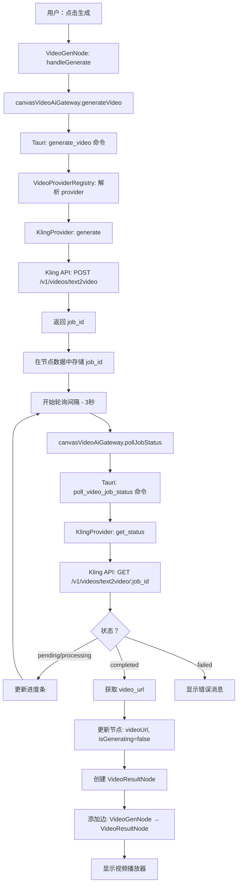
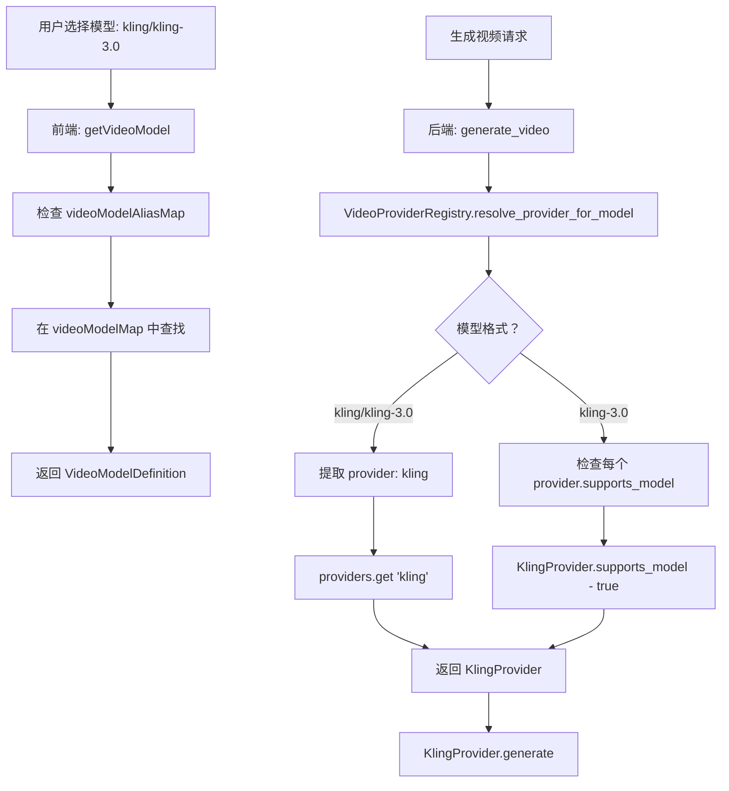

# 视频生成实现指南

**版本：** 1.0
**最后更新：** 2026-03-12
**用途：** 扩展视频生成 API 和 Provider 的参考文档

---

## 目录

1. [架构概览](#架构概览)
2. [后端实现 (Rust/Tauri)](#后端实现-rusttauri)
3. [前端实现 (TypeScript/React)](#前端实现-typescriptreact)
4. [数据流](#数据流)
5. [添加新的视频 Provider](#添加新的视频-provider)
6. [关键模式与约定](#关键模式与约定)
7. [测试](#测试)
8. [故障排查](#故障排查)

---

## 架构概览

视频生成系统采用**供应商无关架构**，与现有的图片生成系统类似。包含以下组成部分：

### 核心组件

**后端 (Rust/Tauri)：**
- `VideoProvider` trait - 定义所有 provider 必须实现的接口
- `VideoProviderRegistry` - 管理 provider 注册和模型路由
- Provider 实现（如 `KlingProvider`）- 处理 API 特定逻辑
- `VideoCacheManager` - 生成视频的 LRU 缓存
- Tauri 命令 - 将 Rust 函数暴露给前端

**前端 (TypeScript/React)：**
- 模型注册表 - 通过 glob 导入自动发现视频模型
- `VideoGenNode` - 视频生成的交互式节点
- `VideoResultNode` - 预览和下载的下游节点
- 视频网关 - 抽象 Tauri 命令调用
- 设置集成 - API 密钥管理和下载路径

### 设计原则

1. **关注点分离** - 后端处理业务逻辑，前端处理 UI
2. **Provider 抽象** - 易于添加新 provider 而无需更改核心逻辑
3. **类型安全** - 完整的 TypeScript 和 Rust 类型定义
4. **异步任务模式** - 提交任务 → 轮询状态 → 显示结果
5. **自动发现** - 通过文件约定注册模型，无需手动注册
6. **与图片系统并行** - 与现有图片生成保持一致的模式

---

## 后端实现 (Rust/Tauri)

### 目录结构

```
src-tauri/src/ai/video/
├── mod.rs                      # VideoProvider trait + 注册表
├── types.rs                    # 核心类型（请求、响应、任务状态）
├── error.rs                    # VideoError 枚举
├── cache_manager.rs            # 视频 LRU 缓存
└── providers/
    ├── mod.rs                  # build_default_video_providers()
    └── kling/
        └── mod.rs              # KlingProvider 实现
```

### 核心类型 (`types.rs`)

```rust
pub struct VideoGenerateRequest {
    pub prompt: String,
    pub model: String,
    pub duration: Option<u32>,
    pub aspect_ratio: Option<String>,
    pub enable_audio: Option<bool>,
    pub seed: Option<i64>,
    pub start_frame_url: Option<String>,
    pub end_frame_url: Option<String>,
    pub extra_params: Option<HashMap<String, serde_json::Value>>,
}

pub struct VideoJobStatus {
    pub job_id: String,
    pub state: VideoJobState,
    pub progress: Option<f32>,
    pub video_url: Option<String>,
    pub error_message: Option<String>,
    pub created_at: Option<i64>,
    pub updated_at: Option<i64>,
}

pub enum VideoJobState {
    Pending,
    Processing,
    Completed,
    Failed,
    Timeout,
}
```

### VideoProvider Trait (`mod.rs`)

```rust
#[async_trait::async_trait]
pub trait VideoProvider: Send + Sync {
    /// 返回 provider 名称（如 "kling"）
    fn name(&self) -> &str;

    /// 检查 provider 是否支持指定模型
    fn supports_model(&self, model: &str) -> bool;

    /// 列出此 provider 支持的所有模型
    fn list_models(&self) -> Vec<String>;

    /// 为此 provider 设置 API 密钥
    async fn set_api_key(&self, api_key: String) -> Result<(), VideoError>;

    /// 提交视频生成任务并返回任务 ID
    async fn generate(&self, request: VideoGenerateRequest) -> Result<String, VideoError>;

    /// 获取视频生成任务的当前状态
    async fn get_status(&self, job_id: &str) -> Result<VideoJobStatus, VideoError>;
}
```

### Provider 实现模式

每个 provider 遵循以下模式：

```rust
pub struct KlingProvider {
    client: Client,
    api_key: Arc<RwLock<Option<String>>>,
    base_url: String,
}

impl KlingProvider {
    pub fn new() -> Self { /* ... */ }

    async fn submit_job(&self, request: VideoGenerateRequest) -> Result<String, VideoError> {
        // 1. 获取 API 密钥
        // 2. 构建请求体（将字段映射到 provider 格式）
        // 3. POST 到 provider 的创建端点
        // 4. 解析响应并返回 job_id
    }

    async fn poll_job_status(&self, job_id: &str) -> Result<VideoJobStatus, VideoError> {
        // 1. GET provider 的状态端点
        // 2. 将 provider 状态映射到 VideoJobState
        // 3. 如果完成则提取 video_url
        // 4. 返回 VideoJobStatus
    }
}

#[async_trait::async_trait]
impl VideoProvider for KlingProvider {
    fn name(&self) -> &str { "kling" }
    fn supports_model(&self, model: &str) -> bool { /* ... */ }
    async fn generate(&self, req: VideoGenerateRequest) -> Result<String, VideoError> {
        self.submit_job(req).await
    }
    async fn get_status(&self, job_id: &str) -> Result<VideoJobStatus, VideoError> {
        self.poll_job_status(job_id).await
    }
}
```

### Tauri 命令 (`src-tauri/src/commands/video.rs`)

暴露给前端的命令：

```rust
#[tauri::command]
pub async fn set_video_api_key(provider: String, api_key: String) -> Result<(), String>

#[tauri::command]
pub async fn generate_video(request: VideoGenerateRequestDto) -> Result<String, String>

#[tauri::command]
pub async fn poll_video_job_status(job_id: String, model: String) -> Result<VideoJobStatus, String>

#[tauri::command]
pub async fn list_video_models() -> Result<Vec<String>, String>

#[tauri::command]
pub async fn cache_video(app: AppHandle, video_url: String, video_id: String) -> Result<String, String>

#[tauri::command]
pub async fn get_video_cache_stats(app: AppHandle) -> Result<VideoCacheStats, String>

#[tauri::command]
pub async fn clear_video_cache(app: AppHandle) -> Result<usize, String>
```

### 注册表模式

```rust
static REGISTRY: std::sync::OnceLock<VideoProviderRegistry> = std::sync::OnceLock::new();

fn get_registry() -> &'static VideoProviderRegistry {
    REGISTRY.get_or_init(|| {
        let mut registry = VideoProviderRegistry::new();
        for provider in build_default_video_providers() {
            registry.register_provider(provider);
        }
        registry
    })
}
```

---

## 前端实现 (TypeScript/React)

### 目录结构

```
src/
├── features/canvas/
│   ├── models/
│   │   ├── types.ts                    # VideoModelDefinition 接口
│   │   ├── videoRegistry.ts            # 自动发现 + 模型查找
│   │   ├── providers/
│   │   │   └── kling.ts                # Provider 元数据
│   │   └── video/
│   │       └── kling/
│   │           └── kling30.ts          # Kling 3.0 模型定义
│   ├── nodes/
│   │   ├── VideoGenNode.tsx            # 视频生成节点
│   │   └── VideoResultNode.tsx         # 视频结果/预览节点
│   ├── domain/
│   │   ├── canvasNodes.ts              # VideoGenNodeData + VideoResultNodeData 类型
│   │   └── nodeRegistry.ts             # 节点注册
│   ├── application/
│   │   ├── ports.ts                    # VideoAiGateway 接口
│   │   └── canvasServices.ts           # Gateway 实例导出
│   └── infrastructure/
│       └── tauriVideoGateway.ts        # VideoAiGateway 实现
├── commands/
│   └── video.ts                        # Tauri 命令包装器
└── stores/
    └── settingsStore.ts                # 视频设置持久化
```

### 模型定义模式 (`video/kling/kling30.ts`)

```typescript
import type { VideoModelDefinition } from '../../types';

export const KLING_30_MODEL_ID = 'kling/kling-3.0';

export const videoModel: VideoModelDefinition = {
  id: KLING_30_MODEL_ID,
  mediaType: 'video',
  displayName: 'Kling 3.0',
  providerId: 'kling',
  description: 'Kling 3.0 专业视频生成模型',
  eta: '~30s',
  expectedDurationMs: 30000,
  defaultDuration: 5,
  defaultAspectRatio: '16:9',
  durations: [
    { value: 3, label: '3s' },
    { value: 5, label: '5s' },
    { value: 10, label: '10s' },
    { value: 15, label: '15s' },
  ],
  aspectRatios: [
    { value: '16:9', label: '16:9' },
    { value: '9:16', label: '9:16' },
    { value: '1:1', label: '1:1' },
  ],
  supportsAudio: true,
  supportsSeed: true,
  supportsImageToVideo: true,
  extraParamsSchema: [
    {
      key: 'multi_shots',
      label: '多镜头',
      type: 'boolean',
      description: '启用多个摄像机角度',
      defaultValue: false,
    },
    {
      key: 'kling_elements',
      label: 'Kling 元素',
      type: 'array',
      description: '定义可在提示词中引用的元素',
    },
  ],
  defaultExtraParams: {
    multi_shots: false,
    kling_elements: [],
  },
};
```

### 自动发现注册表 (`videoRegistry.ts`)

```typescript
const videoModelModules = import.meta.glob<{ videoModel: VideoModelDefinition }>(
  './video/**/*.ts',
  { eager: true }
);

const videoModels: VideoModelDefinition[] = Object.values(videoModelModules)
  .map((module) => module.videoModel)
  .filter((model): model is VideoModelDefinition => Boolean(model))
  .sort((a, b) => a.id.localeCompare(b.id));

export function listVideoModels(): VideoModelDefinition[] {
  return videoModels;
}

export function getVideoModel(modelId: string): VideoModelDefinition {
  const resolvedModelId = videoModelAliasMap.get(modelId) ?? modelId;
  return videoModelMap.get(resolvedModelId) ?? videoModelMap.get(DEFAULT_VIDEO_MODEL_ID)!;
}
```

### 节点数据类型 (`domain/canvasNodes.ts`)

```typescript
export interface VideoGenNodeData extends NodeDisplayData {
  prompt: string;
  model: string;
  duration: number;
  aspectRatio: string;
  enableAudio: boolean;
  seed: number | null;
  startFrameUrl: string | null;
  endFrameUrl: string | null;
  extraParams: Record<string, unknown>;
  videoUrl: string | null;
  thumbnailUrl: string | null;
  isGenerating: boolean;
  generationStartedAt: number | null;
  generationDurationMs: number;
  jobId: string | null;
  errorMessage: string | null;
}

export interface VideoResultNodeData extends NodeDisplayData {
  videoUrl: string;
  thumbnailUrl?: string | null;
  prompt?: string;
  duration?: number;
  aspectRatio?: string;
}
```

### 节点注册 (`domain/nodeRegistry.ts`)

```typescript
const videoGenNodeDefinition: CanvasNodeDefinition<VideoGenNodeData> = {
  type: CANVAS_NODE_TYPES.videoGen,
  menuLabelKey: 'node.menu.videoGeneration',
  menuIcon: 'sparkles',
  visibleInMenu: true,
  capabilities: {
    toolbar: true,
    promptInput: false,
  },
  connectivity: {
    sourceHandle: true,
    targetHandle: true,
    connectMenu: {
      fromSource: true,
      fromTarget: false,
    },
  },
  createDefaultData: () => ({
    displayName: DEFAULT_NODE_DISPLAY_NAME[CANVAS_NODE_TYPES.videoGen],
    prompt: '',
    model: DEFAULT_VIDEO_MODEL_ID,
    duration: 5,
    aspectRatio: '16:9',
    enableAudio: true,
    seed: null,
    startFrameUrl: null,
    endFrameUrl: null,
    extraParams: {},
    videoUrl: null,
    thumbnailUrl: null,
    isGenerating: false,
    generationStartedAt: null,
    generationDurationMs: 0,
    jobId: null,
    errorMessage: null,
  }),
};
```

### VideoGenNode 组件模式

关键职责：
1. **提示词输入** - 支持引用 token（@图1、@图2）
2. **帧选择** - 从连接的图片中选择起始/结束帧的可视化 UI
3. **参数控制** - 模型、时长、宽高比、音频、种子
4. **额外参数** - multi_shots、kling_elements
5. **生成** - 通过网关提交任务，存储 job_id
6. **轮询** - 3 秒间隔，更新进度，处理完成
7. **结果节点创建** - 成功时自动创建 VideoResultNode

```typescript
// 轮询效果（简化版）
useEffect(() => {
  if (!data.isGenerating || !data.jobId) return;

  const pollStatus = async () => {
    const status = await canvasVideoAiGateway.pollJobStatus(data.jobId!, data.model);

    if (status.state === 'completed' && status.videoUrl) {
      updateNodeData(id, {
        videoUrl: status.videoUrl,
        isGenerating: false,
        jobId: null,
      });

      // 创建下游 VideoResultNode
      const resultPosition = findNodePosition(id, VIDEO_RESULT_NODE_WIDTH, VIDEO_RESULT_NODE_HEIGHT);
      const resultNodeId = addNode(CANVAS_NODE_TYPES.videoResult, resultPosition, {
        videoUrl: status.videoUrl,
        prompt: data.prompt,
        duration: data.duration,
        aspectRatio: data.aspectRatio,
      });
      addEdge(id, resultNodeId);
    }
  };

  pollStatus();
  const intervalId = setInterval(pollStatus, 3000);
  return () => clearInterval(intervalId);
}, [data.isGenerating, data.jobId, /* ... */]);
```

### VideoResultNode 组件

职责：
1. **视频预览** - 带控制条的 HTML5 `<video>` 元素
2. **下载** - 浏览器下载（fetch + blob）或 Tauri 文件保存
3. **预设路径** - 显示设置中最多 3 个快速下载按钮

```typescript
const handleDownload = async (targetPath?: string) => {
  if (targetPath) {
    // Tauri 文件保存
    await downloadVideoToDirectory(url, `${targetPath}/${filename}`, true);
  } else {
    // 浏览器下载
    const response = await fetch(url);
    const blob = await response.blob();
    const blobUrl = URL.createObjectURL(blob);
    const link = document.createElement('a');
    link.href = blobUrl;
    link.download = filename;
    link.click();
    setTimeout(() => URL.revokeObjectURL(blobUrl), 1000);
  }
};
```

---

## 数据流

### 视频生成流程



### 模型解析流程



---

## 添加新的视频 Provider

按照以下步骤添加新的视频 provider（例如 "runway"）：

### 步骤 1：后端 - 创建 Provider 实现

**文件：** `src-tauri/src/ai/video/providers/runway/mod.rs`

```rust
use reqwest::Client;
use std::sync::Arc;
use tokio::sync::RwLock;

use crate::ai::video::error::VideoError;
use crate::ai::video::types::{VideoGenerateRequest, VideoJobState, VideoJobStatus};
use crate::ai::video::VideoProvider;

const RUNWAY_BASE_URL: &str = "https://api.runwayml.com";
const SUPPORTED_MODELS: [&str; 2] = ["gen-3", "runway/gen-3"];

// 定义请求/响应 DTO
#[derive(Debug, Serialize)]
struct RunwayCreateRequest {
    prompt: String,
    duration: Option<u32>,
    // ... 其他字段
}

#[derive(Debug, Deserialize)]
struct RunwayCreateResponse {
    id: String,
    status: String,
}

pub struct RunwayProvider {
    client: Client,
    api_key: Arc<RwLock<Option<String>>>,
}

impl RunwayProvider {
    pub fn new() -> Self {
        Self {
            client: Client::new(),
            api_key: Arc::new(RwLock::new(None)),
        }
    }

    async fn submit_job(&self, request: VideoGenerateRequest) -> Result<String, VideoError> {
        // 1. 获取 API 密钥
        let api_key = self.api_key.read().await.clone()
            .ok_or_else(|| VideoError::InvalidRequest("API key not set".into()))?;

        // 2. 构建请求体
        let body = RunwayCreateRequest {
            prompt: request.prompt,
            duration: request.duration,
        };

        // 3. POST 到 Runway API
        let response = self.client
            .post(&format!("{}/v1/generations", RUNWAY_BASE_URL))
            .header("Authorization", format!("Bearer {}", api_key))
            .json(&body)
            .send()
            .await?;

        // 4. 解析并返回 job_id
        let result: RunwayCreateResponse = response.json().await?;
        Ok(result.id)
    }

    async fn poll_job_status(&self, job_id: &str) -> Result<VideoJobStatus, VideoError> {
        // 类似模式：GET 状态端点，映射到 VideoJobStatus
        // ...
    }
}

#[async_trait::async_trait]
impl VideoProvider for RunwayProvider {
    fn name(&self) -> &str { "runway" }

    fn supports_model(&self, model: &str) -> bool {
        SUPPORTED_MODELS.contains(&model) || model.starts_with("runway/")
    }

    fn list_models(&self) -> Vec<String> {
        vec!["runway/gen-3".to_string()]
    }

    async fn set_api_key(&self, api_key: String) -> Result<(), VideoError> {
        *self.api_key.write().await = Some(api_key);
        Ok(())
    }

    async fn generate(&self, request: VideoGenerateRequest) -> Result<String, VideoError> {
        self.submit_job(request).await
    }

    async fn get_status(&self, job_id: &str) -> Result<VideoJobStatus, VideoError> {
        self.poll_job_status(job_id).await
    }
}
```

**文件：** `src-tauri/src/ai/video/providers/mod.rs`

```rust
pub mod kling;
pub mod runway;  // 添加这一行

use std::sync::Arc;
use crate::ai::video::VideoProvider;

pub fn build_default_video_providers() -> Vec<Arc<dyn VideoProvider>> {
    vec![
        Arc::new(kling::KlingProvider::new()),
        Arc::new(runway::RunwayProvider::new()),  // 添加这一行
    ]
}
```

### 步骤 2：前端 - 创建 Provider 元数据

**文件：** `src/features/canvas/models/providers/runway.ts`

```typescript
import type { ModelProviderDefinition } from '../types';

export const provider: ModelProviderDefinition = {
  id: 'runway',
  name: 'Runway',
  label: 'Runway ML',
};
```

### 步骤 3：前端 - 创建模型定义

**文件：** `src/features/canvas/models/video/runway/gen3.ts`

```typescript
import type { VideoModelDefinition } from '../../types';

export const RUNWAY_GEN3_MODEL_ID = 'runway/gen-3';

export const videoModel: VideoModelDefinition = {
  id: RUNWAY_GEN3_MODEL_ID,
  mediaType: 'video',
  displayName: 'Gen-3 Alpha',
  providerId: 'runway',
  description: 'Runway Gen-3 Alpha turbo 视频生成',
  eta: '~45s',
  expectedDurationMs: 45000,
  defaultDuration: 5,
  defaultAspectRatio: '16:9',
  durations: [
    { value: 5, label: '5s' },
    { value: 10, label: '10s' },
  ],
  aspectRatios: [
    { value: '16:9', label: '16:9' },
    { value: '9:16', label: '9:16' },
  ],
  supportsAudio: false,
  supportsSeed: true,
  supportsImageToVideo: true,
  extraParamsSchema: [],
  defaultExtraParams: {},
};
```

**注意：** 文件必须在顶层导出 `videoModel`。注册表使用 `import.meta.glob` 自动发现所有 `video/**/*.ts` 文件。

### 步骤 4：前端 - 添加 i18n 翻译

**文件：** `src/i18n/locales/en.json`

```json
{
  "settings": {
    "providers": "API Key",
    "providerRunwayName": "Runway ML"
  }
}
```

**文件：** `src/i18n/locales/zh.json`

```json
{
  "settings": {
    "providers": "API 密钥",
    "providerRunwayName": "Runway ML"
  }
}
```

### 步骤 5：更新设置（可选）

如果 provider 需要除 API 密钥外的特殊设置：

**文件：** `src/stores/settingsStore.ts`

```typescript
interface SettingsState {
  apiKeys: Record<string, string>;
  // 如需要，添加 provider 特定设置
  runwaySettings?: {
    useAlphaTurbo: boolean;
  };
}
```

### 步骤 6：测试

1. **后端测试：**
   ```bash
   cd src-tauri && cargo check
   ```

2. **前端测试：**
   ```bash
   npx tsc --noEmit
   ```

3. **集成测试：**
   - 启动应用：`npm run tauri dev`
   - 打开设置 → API 密钥 → 添加 Runway API 密钥
   - 创建 VideoGenNode
   - 从模型下拉菜单选择 "Gen-3 Alpha"
   - 验证模型出现且参数正确
   - 使用实际 API 密钥测试生成

### 步骤 7：更新文档

将 provider 添加到 `video-generation-implementation.md`：
- 列出支持的模型
- 注明任何特殊参数或行为
- 记录 API 端点 URL 和速率限制

---

## 关键模式与约定

### 1. Provider 命名约定

- **Provider ID：** 小写，无空格（如 `kling`、`runway`）
- **模型 ID 格式：** `{provider}/{model}`（如 `kling/kling-3.0`、`runway/gen-3`）
- **模型别名：** 将短名称映射到完整 ID（如 `kling-3.0` → `kling/kling-3.0`）

### 2. 异步任务模式

所有 provider 遵循相同模式：
1. **提交** - `generate()` 返回 `job_id`
2. **轮询** - `get_status(job_id)` 返回 `VideoJobStatus`
3. **完成** - 前端在 `state === 'completed'` 时创建结果节点

此模式适用于快速（秒级）和慢速（分钟级）provider。

### 3. 错误处理

**后端：**
- 所有错误使用 `VideoError` 枚举
- 将 provider 特定错误映射到通用类别
- 包含详细消息用于调试

**前端：**
- 通过 `showErrorDialog` 显示用户友好消息
- 将详细错误记录到控制台
- 为瞬态失败提供重试按钮

### 4. 类型安全

- **Rust：** 所有数据结构使用 `serde` 进行序列化
- **TypeScript：** 所有类型在 `types.ts` 中定义，跨模块使用
- **DTO 映射：** 前后端类型之间的显式转换

### 5. 状态管理

**节点数据：**
- 所有生成状态在 `VideoGenNodeData` 中
- 使用 `updateNodeData()` 修改，不直接变更
- 通过 `projectStore` 持久化到 SQLite

**设置：**
- API 密钥在 `settingsStore.apiKeys` 中
- Provider 特定设置在 provider 命名空间字段中
- 持久化到 localStorage

### 6. UI 一致性

- **节点控制：** 使用 `nodeControlStyles.ts` 的共享样式
- **浮动面板：** 使用 `VideoParamsControls` 模式（基于 portal）
- **图标：** 使用 lucide-react 保持一致性
- **颜色：** 遵循 `index.css` 中的设计 token

### 7. 参考帧

图生视频支持：
- **起始帧：** 图生视频必需
- **结束帧：** 可选（provider 特定）
- **帧选择 UI：** 带复选标记的可视化网格
- **帧编码：** Provider 处理 base64/URL 转换

### 8. 额外参数

通过 `extraParamsSchema` 提供 provider 特定参数：
- **Boolean：** 切换（如 multi_shots）
- **String：** 文本输入（如 negative_prompt）
- **Array：** 自定义编辑器（如 kling_elements）
- **Number：** 滑块或输入
- **Enum：** 下拉选择

---

## 测试

### 单元测试

**后端 (Rust)：**
```rust
#[cfg(test)]
mod tests {
    use super::*;

    #[test]
    fn test_supports_model() {
        let provider = KlingProvider::new();
        assert!(provider.supports_model("kling/kling-3.0"));
        assert!(provider.supports_model("kling-3.0"));
        assert!(!provider.supports_model("runway/gen-3"));
    }

    #[test]
    fn test_status_mapping() {
        assert_eq!(KlingProvider::map_status_to_state("submitted"), VideoJobState::Pending);
        assert_eq!(KlingProvider::map_status_to_state("processing"), VideoJobState::Processing);
        assert_eq!(KlingProvider::map_status_to_state("succeed"), VideoJobState::Completed);
    }
}
```

**前端 (TypeScript)：**
```typescript
// src/test/unit/videoRegistry.test.ts
describe('videoRegistry', () => {
  it('列出所有视频模型', () => {
    const models = listVideoModels();
    expect(models.length).toBeGreaterThan(0);
    expect(models[0].mediaType).toBe('video');
  });

  it('通过 ID 解析模型', () => {
    const model = getVideoModel('kling/kling-3.0');
    expect(model.displayName).toBe('Kling 3.0');
    expect(model.providerId).toBe('kling');
  });

  it('处理模型别名', () => {
    const model = getVideoModel('kling-3.0');
    expect(model.id).toBe('kling/kling-3.0');
  });
});
```

### 集成测试

**端到端流程：**
1. 创建 `VideoGenNode`
2. 连接 `ImageEditNode` → `VideoGenNode`（用于参考帧）
3. 选择帧，输入提示词
4. 点击生成（模拟 API 响应）
5. 验证轮询开始
6. 模拟完成响应
7. 验证 `VideoResultNode` 已创建
8. 验证边已创建
9. 验证视频播放器显示 URL

**使用真实 API 测试：**
```bash
# 在设置中设置 API 密钥
# 创建 VideoGenNode
# 输入提示词："日落时的宁静山景"
# 点击生成
# 等待完成（~30秒）
# 验证视频播放器显示结果
# 点击下载
# 验证文件已保存
```

### 模拟数据

**示例视频 URL：** `https://commondatastorage.googleapis.com/gtv-videos-bucket/sample/BigBuckBunny.mp4`

用于在不调用 API 的情况下测试 VideoResultNode：
```typescript
const testVideoData: VideoResultNodeData = {
  displayName: '测试视频',
  videoUrl: 'https://commondatastorage.googleapis.com/gtv-videos-bucket/sample/BigBuckBunny.mp4',
  prompt: '测试视频生成',
  duration: 5,
  aspectRatio: '16:9',
};
```

---

## 故障排查

### 常见问题

**1. 找不到 Provider**
- **症状：** "Video provider not found" 错误
- **原因：** Provider 未在 `build_default_video_providers()` 中注册
- **修复：** 将 provider 添加到 `providers/mod.rs`

**2. 模型未出现在下拉菜单中**
- **症状：** VideoGenNode 模型选择器中缺少模型
- **原因：** 模型文件不在 `video/**/*.ts` 中或缺少 `videoModel` 导出
- **修复：** 检查文件位置和导出名称

**3. 轮询永不完成**
- **症状：** 进度条卡在 95%，无结果
- **原因：** 状态映射不正确或 API 返回意外状态
- **修复：** 检查 provider 的 `map_status_to_state()` 函数
- **调试：** 在 `poll_job_status()` 中添加日志以查看原始 API 响应

**4. 下载按钮不工作**
- **症状：** 点击下载，无反应
- **原因：** CORS 问题或网络错误
- **修复：** 检查浏览器控制台是否有错误
- **解决方法：** 使用 fetch + blob 方法（已实现）

**5. API 密钥不持久化**
- **症状：** 重启后 API 密钥丢失
- **原因：** 设置未保存到 localStorage
- **修复：** 检查 `settingsStore` 版本迁移

**6. 添加模型后 TypeScript 错误**
- **症状：** `npx tsc --noEmit` 失败
- **原因：** 类型定义缺失或不正确
- **修复：** 确保 `VideoModelDefinition` 字段完整
- **检查：** 所有必需字段：`id`、`mediaType`、`displayName`、`providerId`、`durations`、`aspectRatios` 等

**7. 帧选择不显示图片**
- **症状：** 帧选择面板为空
- **原因：** 没有传入边或图片未解析
- **修复：** 使用 `graphImageResolver.collectInputImages()` 验证边存在

### 调试提示

**后端：**
- 启用调试日志：`RUST_LOG=debug npm run tauri dev`
- 检查日志：查找 `[Kling API]`、`[VideoCommand]` 前缀
- 使用 `tracing::info!` 记录 API 请求/响应

**前端：**
- 打开 DevTools 控制台
- 查找 `[Video]` 前缀的日志
- 检查网络选项卡中的 Tauri invoke 调用
- 使用 React DevTools 检查节点数据

**API 测试：**
- 使用 Postman/curl 直接测试 provider API
- 验证 API 密钥有效性
- 检查速率限制和配额
- 确认请求/响应格式与实现匹配

---

## 附录：文件检查清单

添加名为 `{provider}` 的新 provider 和模型 `{model}` 时：

### 后端
- [ ] `src-tauri/src/ai/video/providers/{provider}/mod.rs` - Provider 实现
- [ ] `src-tauri/src/ai/video/providers/mod.rs` - 添加到 `build_default_video_providers()`
- [ ] 运行 `cargo check` - 验证编译

### 前端
- [ ] `src/features/canvas/models/providers/{provider}.ts` - Provider 元数据
- [ ] `src/features/canvas/models/video/{provider}/{model}.ts` - 模型定义（必须导出 `videoModel`）
- [ ] `src/i18n/locales/en.json` - 英文翻译
- [ ] `src/i18n/locales/zh.json` - 中文翻译
- [ ] 运行 `npx tsc --noEmit` - 验证类型检查

### 测试
- [ ] 在设置对话框中测试 API 密钥设置
- [ ] 在 VideoGenNode 下拉菜单中测试模型选择
- [ ] 使用真实 API 测试生成
- [ ] 测试轮询和完成
- [ ] 测试 VideoResultNode 创建
- [ ] 测试下载功能

### 文档
- [ ] 使用 provider 详细信息更新此文件
- [ ] 记录任何 provider 特定行为
- [ ] 添加示例用法

---

## 版本历史

- **1.0 (2026-03-12)** - 初始文档
  - Kling 3.0 provider 实现
  - 带轮询和帧选择的 VideoGenNode
  - 带下载支持的 VideoResultNode
  - 自动发现模型注册表
  - 带 LRU 驱逐的缓存管理器
  - API 密钥的设置集成

---

## 参考

- **图片生成系统：** `src/features/canvas/models/registry.ts`、`src/features/canvas/nodes/ImageEditNode.tsx`
- **Provider 模式：** `src-tauri/src/ai/mod.rs`、`src-tauri/src/ai/providers/*`
- **节点系统：** `src/features/canvas/domain/nodeRegistry.ts`
- **设计规范：** `docs/superpowers/specs/2026-03-12-video-generation-design.md`

---

**文档结束**
